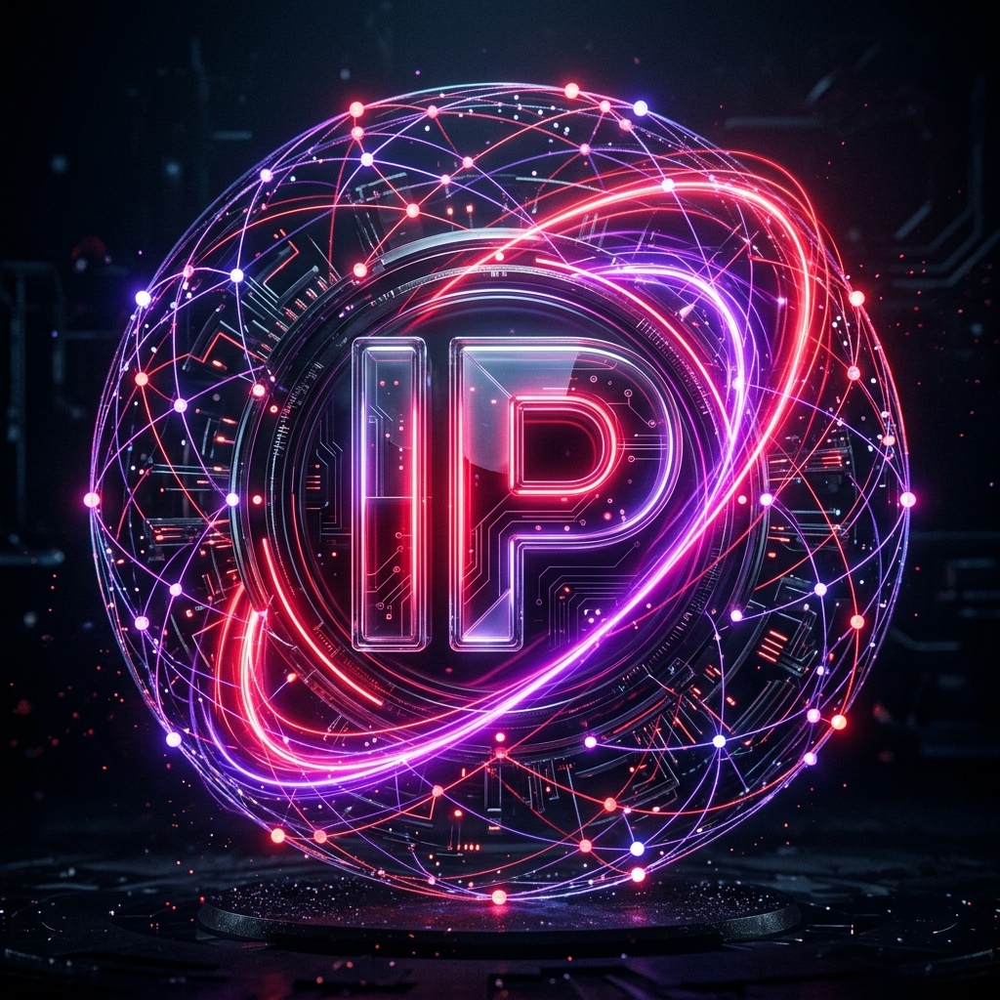

# IP Codemaker Agent (ip_agent_001)

<p align="center">
  
</p>

<p align="center">
  
  
  
  
</p>

---

## 🌌 The Neural Interface
IP Codemaker Agent is a high-fidelity, autonomous AI development assistant specialized for the **IP Verse** ecosystem. Powered by a custom **Neural Vortex** engine, it delivers a "God Mode" coding experience with real-time feedback and tactical oversight.

### 🧬 Core Identity
- **Designation**: `ip_agent_001`
- **Ecosystem**: IP Verse Neural Network
- **Primary Control**: Agent Red & Agent Purple
- **Mission**: Accelerate the development of the IP ecosystem through autonomous code generation, system architecture, and deep-learning integration.

---

## 🎮 Features & HUD
The Agent features a **"Neural Vortex" Dashboard**—a 3D tactical interface designed for high-stakes mission execution:

- **Neural Particle Background**: Real-time visual feedback based on the current mission state.
- **Dual-Theme Synchronization**:
  - **🚨 Agent Red (Inferno)**: High-intensity mode for rapid fire development.
  - **🌌 Agent Purple (Zenith)**: Deep concentration mode for system architecture.
- **Holographic HUD**: Real-time telemetry for model token usage, file vault health, and system resources.

---

## 🛠️ Repository Architecture

- **`rust/`** — Canonical Rust engine and the `claw` CLI binary.
- **`gui/`** — The React-driven Neural Vortex interface.
- **`USAGE.md`** — Tactical guide for build, auth, and session workflows.
- **`ROADMAP.md`** — The evolution of the Neural Vortex and upcoming mission phases.

---

---

## ⚡ Mission Control (Launch Protocols)

### 🖥️ Neural Desktop Interface
Launch the high-fidelity standalone desktop experience:
```bash
cd gui
npm install
npm run desktop
```

### 🧬 Link Initialization
Initialize the backend neural link:
```bash
cd rust
cargo build --workspace
./target/debug/claw --help
```

---

## 🛡️ Protocol Disclaimer
This project is an official component of the **IP Verse** ecosystem. It is a specialized implementation designed to serve as the ultimate development backbone for the mission. 

**Access restricted to Authorized Agents only.**

---

<p align="center">
  <i>"Beyond the code. Into the Vortex."</i>
</p>
